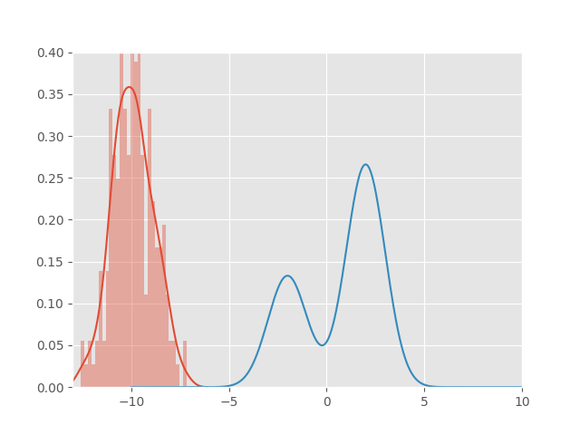

# steins-method
Implementation of kernelized Stein discrepancy and experiements with Stein variational gradient descent.

## papers

This contains implementations of the following papers:

[Q. Liu, D. Wang] Stein variational gradient descent: a general purpose bayesian inference algorithm -- arXiv:1608.04471v2

[Q. Liu] Stein variational gradient descent as gradient flow -- arXiv:1704.07520v2

